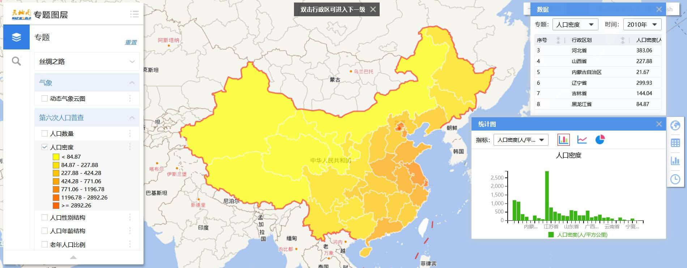

# 勘误表

> 最后更新：2026年2月13日

## 第1章

### **章节**：1.1.1　**页码**：1　
- **位置**：第2段第2行  
- **错误**：地理信息科学门综合性很强的跨学科领域  
- **修正**：地理信息科学是一门综合性很强的跨学科领域
  
---
  
## 第3章

### **章节**：3.4.1　**页码**：54
   - **位置**：例3.2中的代码  
   - **修正**：函数名 voidCreateSrs 修正为 void CreateSrs
  
### **章节**：3.4.2　**页码**：56
   - **位置**：例3.3中的代码  
   - **修正**：
     - 函数名 voidCreateSrs 修正为 void CreateSrs
     - 注释 “CGCS2000” 修正为 “WGS84”
     - 注释 “Tm投影” 修正为 “Web墨卡托”

### **章节**：3.5.1　**页码**：54
   - **位置**：例3.4中的代码  
   - **修正**：
     - 函数名 voidCreateSrs 修正为 void CreateSrs
     - 注释 “CGCS2000” 修正为 “WGS84”
     - 注释 “Tm投影” 修正为 “地心地固坐标系”

---

## 第5章

### **章节**：5.1.2　**页码**：131
   - **位置**：倒数第三段结尾部分：“图5.5为天地图上的人口密度专题图”。
   - **修正**：图5.5因故被被删去，这里补充展示
   
    

## 参考文献
### **页码**：586　
- **位置**：第[33]篇文献
- **错误**：https://www.cnblogs.com/nnaaoveGI/p/5508882.html
- **修正**：https://www.cnblogs.com/naaoveGIS/p/5508882.html