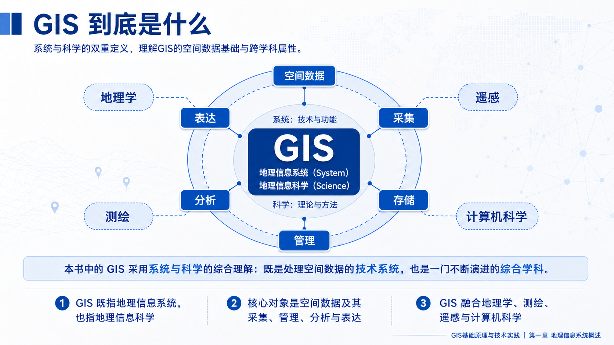
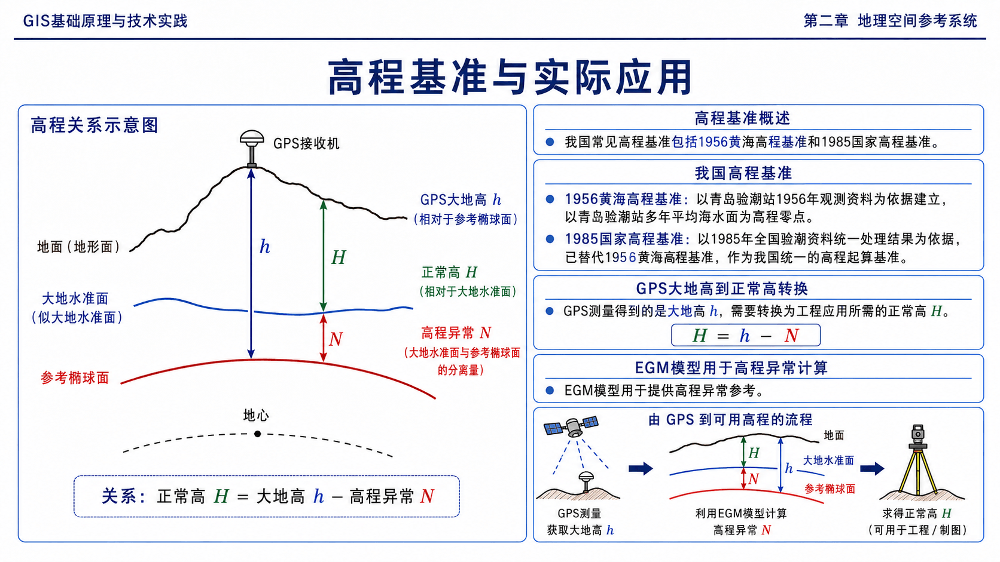
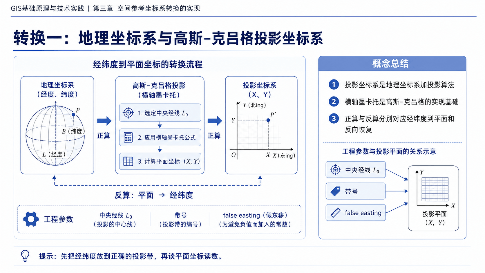
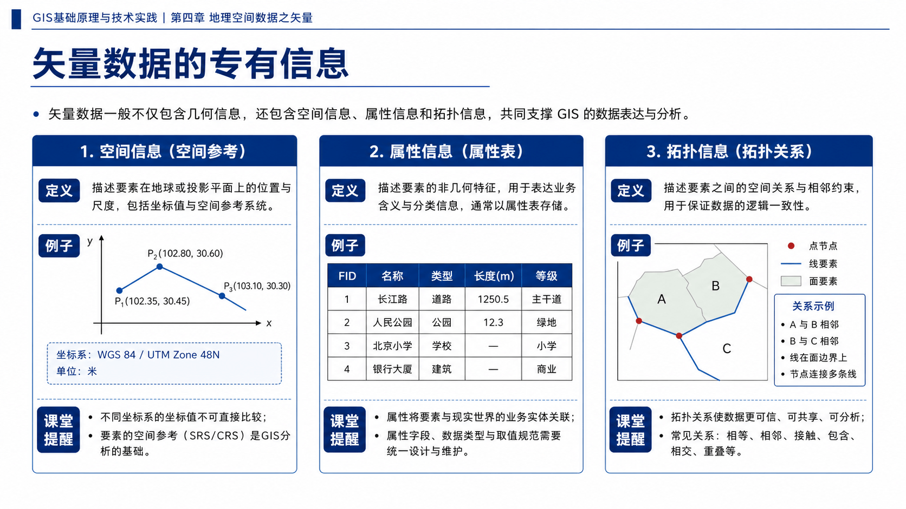
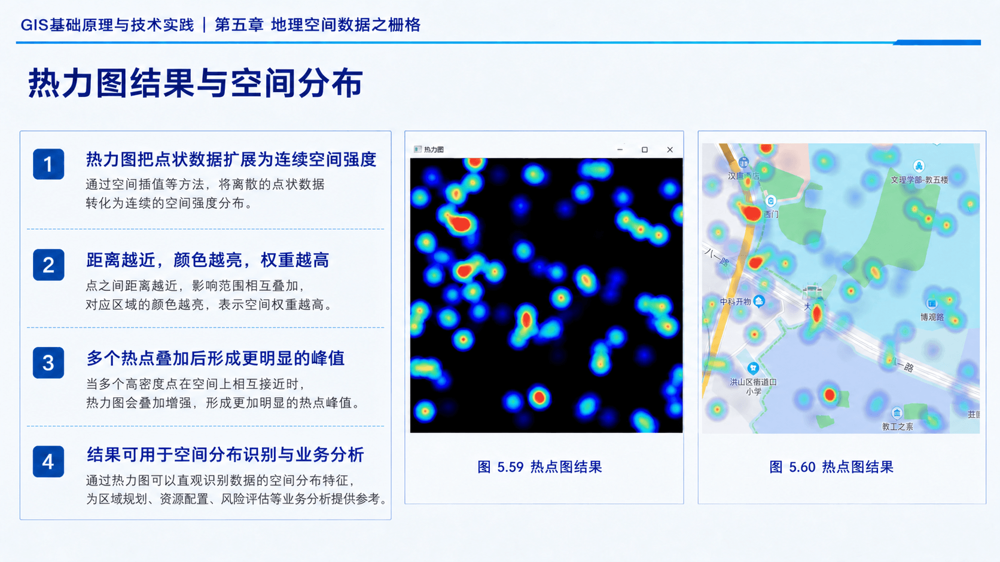
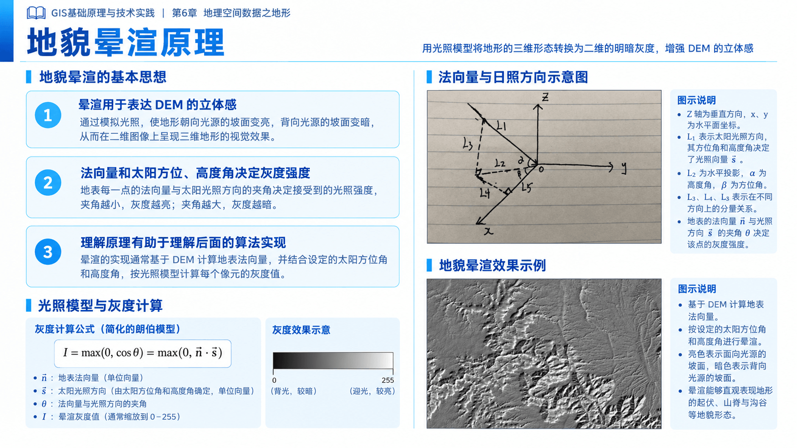
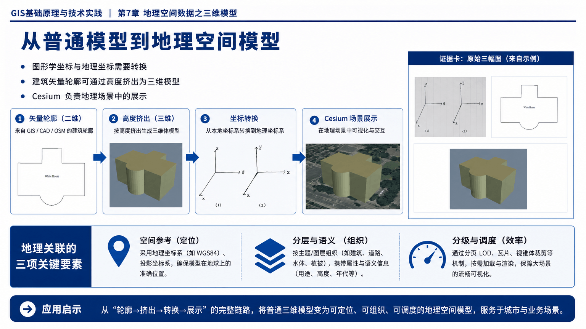
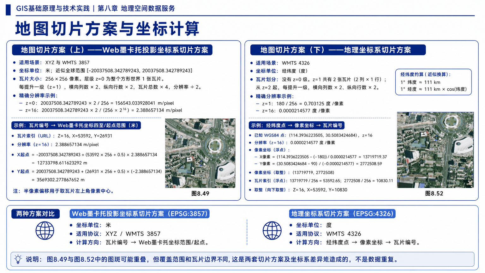
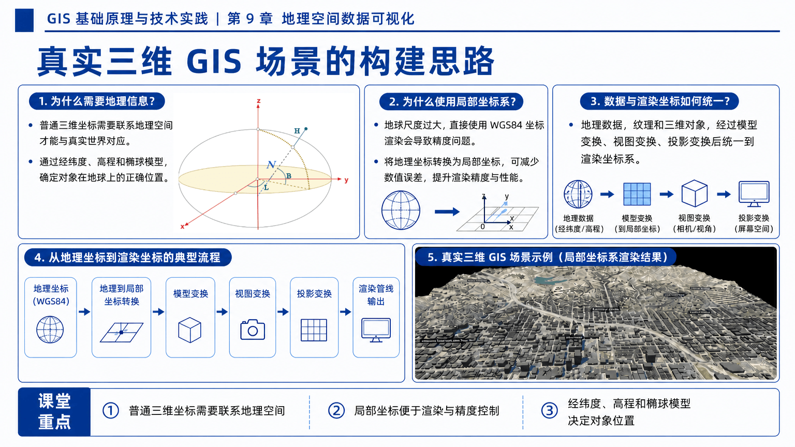
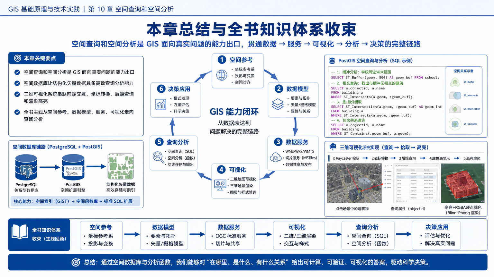

# 《GIS基础原理与技术实践》配套教学课件

> 💻 **配套开源项目**：[GitHub](https://github.com/fafa1899/GISBasic) | [GitCode](https://gitcode.com/charlee44/GISBasic)

## 📋 内容概述

《GIS基础原理与技术实践》的配套 PPT 课件现已加入配套资源库。课件按照教材章节组织，每章对应一个 PPT 文件，内容与教材结构保持一致，覆盖各章的核心概念、技术方法与实践要点。读者可将其用于课堂教学、课程备课、自学梳理和章节复习，也可以在阅读代码案例之前，先通过课件建立完整的知识脉络。

## 📚 课件目录

课件位于项目根目录的 `PPT/` 文件夹中，目录和预览页如下：

- **第 1 章 地理信息系统概述**
  
- **第 2 章 地理空间参考系统**
  
- **第 3 章 空间参考坐标系转换的实现**
  
- **第 4 章 地理空间数据之矢量**
 
- **第 5 章 地理空间数据之栅格**
  
- **第 6 章 地理空间数据之地形**
    
- **第 7 章 地理空间数据之三维模型**
    
- **第 8 章 地理空间数据服务**
   
- **第 9 章 地理空间数据可视化**
 
- **第 10 章 空间查询和空间分析**
 

预览图仅展示各章课件的部分页面，完整内容请下载对应的 `.pptx` 文件查看。

## 🧭 使用建议

建议读者结合教材正文、示例代码和实验数据一起使用本课件：

- 课前或阅读前，可先浏览课件建立章节知识框架；
- 学习代码案例时，可对照课件中的概念、流程和图示理解实现思路；
- 课程教学中，可根据教学进度对课件内容进行适当裁剪和补充。

## 📌 课件说明

1. 本课件使用了语言大模型辅助生成，生成过程中使用了 [codex-ppt-skill](https://github.com/ningzimu/codex-ppt-skill/tree/main) 提供的课件生成流程与模板能力。由于生成的页面是 `gpt-image-2` 生成的图片，因此暂不支持直接编辑其中的文字和版式内容。

2. 课件主要面向教材配套学习、课堂教学、课程备课和个人复习使用。课件内容仅供学习与教学交流使用，如需转载、改编或用于其他公开场景，请注明来源。

## 📝 反馈勘误

如果发现课件内容存在错误、遗漏或表述不清之处，欢迎通过项目 **[Issue](https://github.com/fafa1899/GISBasic/issues/new)** 反馈。

